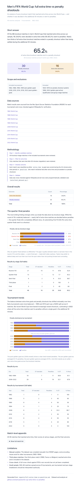

# World Cup Penalties — extra time vs penalty shootouts

[](LICENSE)

<p align="center">
  
</p>

Analysis of knockout matches in men's FIFA World Cups that reached extra time,
excluding the golden-goal tournaments (1998, 2002).

## Research question

In men's FIFA World Cups where teams played full extra time and penalty
shootouts were available (excluding golden-goal World Cups):

1. How many knockout matches that reached extra time were decided during
   extra time?
2. How many were still tied after extra time and went to penalty kicks?

## Quick start

```bash
uv sync
uv run python -m world_cup_penalties.collect   # download RSSSF data
uv run python -m world_cup_penalties.analyze    # print analysis tables
uv run python -m world_cup_penalties.report     # generate markdown report
uv run pytest                                   # run all tests (40 pass)
uv run ruff check .                             # lint
```

> Raw RSSSF HTML pages are not committed to the repo.
> Run `collect.py` to re-download them on first use.

## HTML report

An interactive HTML version of the report with embedded data visualisations is available at:

```
reports/full-extra-time-vs-penalties.html
```

Open it directly in a browser. It features stacked bar charts for the stage breakdown and tournament trends, plus a collapsible full match appendix.

## Project structure

```
world-cup-penalties/
├── data/
│   ├── raw/rsssf/         # Downloaded RSSSF HTML pages
│   ├── interim/           # (optional intermediate tables)
│   └── processed/         # extra_time_matches.csv
├── reports/               # Generated markdown report
├── src/world_cup_penalties/
│   ├── config.py          # Constants and paths
│   ├── collect.py         # Download RSSSF pages
│   ├── clean.py           # Placeholder
│   ├── classify.py        # Outcome classification
│   ├── analyze.py         # Analysis tables
│   └── report.py          # Report generation
├── tests/
│   ├── test_classify.py   # Unit tests (11)
│   └── test_dataset.py    # Dataset validation (29)
└── pyproject.toml
```

## Key results

| Outcome               | Count | Percentage |
| --------------------- | ----: | :--------: |
| Decided in extra time |    16 |     34.8%  |
| Went to penalties     |    30 |     65.2%  |
| **Total**             |  **46** |   **100%** |

## Scope

- **Included:** 1982, 1986, 1990, 1994, 2006, 2010, 2014, 2018, 2022
- **Excluded:** pre-1982 (no penalties), 1998 & 2002 (golden goal)

## Data sources

- [RSSSF](https://www.rsssf.org/) — primary match data
- Wikipedia tournament pages — cross-verification
